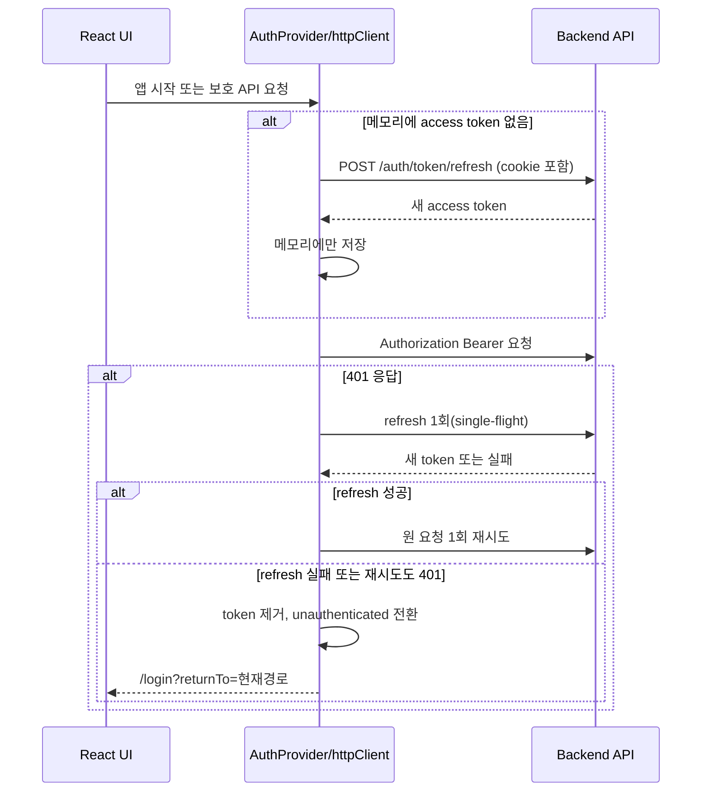
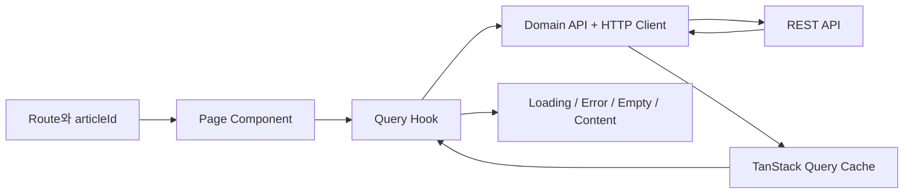

# 하비루프 React 마이그레이션 계획 및 설계

## 1. 문서 목적

이 문서는 현재 여러 HTML 문서와 바닐라 JavaScript로 구성된 하비루프 프런트엔드를 React 단일 페이지 애플리케이션(SPA)으로 전환하기 위한 기준 문서다. 목표는 기존 UI와 API 동작을 유지하면서 다음 문제를 해결하는 것이다.

- 페이지마다 반복되는 DOM 조회, 이벤트 등록, 상태 클래스 조작을 선언형 컴포넌트로 전환한다.
- 인증, 서버 데이터, 폼, 일시적 UI 상태의 책임을 분리한다.
- 페이지 이동마다 새 문서를 로드하는 구조를 클라이언트 라우팅으로 전환한다.
- API 오류, 로딩, 빈 화면, 권한에 대한 동작을 일관되게 만든다.
- 기능 단위 테스트와 자동 회귀 검증이 가능한 구조를 만든다.

### 마이그레이션 범위

- 대상: `index.html`, `pages/`, `js/`, `css/`, `assets/`에 있는 프런트엔드 전체
- 유지: 현재 백엔드 REST API와 refresh cookie 기반 인증 방식, 기존 디자인과 접근성 의도
- 제외: 백엔드 API 구현 변경, 대규모 UI 리디자인, 모바일 앱 또는 SSR 도입

### 권장 전환 전략

레거시 파일을 즉시 삭제하지 않고 React 앱을 별도 엔트리에서 완성한 뒤 한 번에 진입점을 전환한다. 각 React 라우트는 레거시 화면과 기능 동등성 검증을 통과해야 한다. 현재 정적 다중 페이지와 SPA를 운영 환경에서 동시에 라우팅하려면 서버 rewrite 규칙이 추가로 필요하므로, 별도 요구가 없다면 런타임 혼합보다 **브랜치 내부의 점진적 구현 + 최종 일괄 전환**이 안전하다.

---

## 2. 기존 프로젝트 분석

### 2.1 기술 및 구조 현황

| 구분 | 현재 상태 | React 전환 시 처리 |
| --- | --- | --- |
| 실행 구조 | 빌드 도구 없는 정적 HTML 다중 페이지 | Vite 기반 React SPA |
| 언어 | ES Module JavaScript | React + TypeScript 권장 |
| 라우팅 | HTML 경로와 `window.location` | React Router의 route/param/navigation |
| DOM 갱신 | `querySelector`, `createElement`, class 토글 | props/state 기반 렌더링 |
| API | `js/common/fetch.js`의 함수 모음 | 도메인별 API 모듈과 공통 HTTP client |
| 인증 | 메모리 access token + refresh cookie | AuthProvider와 단일-flight refresh |
| 서버 상태 | 페이지 모듈의 전역 변수 | TanStack Query query/mutation cache |
| 폼 | input 이벤트와 직접 검증 | React Hook Form + 공통 검증 함수 |
| 스타일 | 전역 및 페이지별 CSS | 1차로 기존 CSS 재사용, 이후 모듈화 선택 |
| 테스트 | 테스트/스크립트 없음 | Vitest, Testing Library, MSW, Playwright 권장 |
| 환경 설정 | API 주소가 `localhost:8080`으로 고정 | `VITE_API_BASE_URL` 환경 변수 |

`package.json`에는 주석이 포함되어 있어 유효한 JSON이 아니며, 실행·빌드·테스트 스크립트도 없다. React scaffold 단계에서 먼저 정상화해야 한다.

### 2.2 현재 페이지와 주요 기능

| 현재 페이지 | 주요 기능 | 주요 API/상태 | React 목표 라우트 |
| --- | --- | --- | --- |
| `index.html` | 로그인 페이지로 즉시 이동 | meta refresh | `/` → 인증 상태에 따라 `/posts` 또는 `/login` |
| `pages/auth/login.html` | 이메일/비밀번호 검증, 로그인, access token 저장 | `POST /auth/login` | `/login` |
| `pages/auth/signup.html` | 프로필 이미지 미리보기/업로드, 이메일·비밀번호·확인·닉네임 검증, 회원가입 | `POST /users/me/profile-image`, `POST /users` | `/signup` |
| `pages/posts/list.html` | 게시글 카드, 이미지 fallback, 좋아요·댓글·조회수 표시, cursor 기반 무한 스크롤, 빈/오류/추가 로딩 상태 | `GET /articles` | `/posts` |
| `pages/posts/detail.html` | 게시글 조회, 이미지 갤러리, 조회수 증가, 좋아요 토글, 게시글 수정/삭제, 댓글 목록·작성·수정·삭제, 대댓글 형태 표시, 댓글 무한 스크롤, 삭제 확인 모달 | article/comment/like/view API | `/posts/:articleId` |
| `pages/posts/create.html` | 제목·내용 입력, 여러 이미지 미리보기/업로드, 게시글 작성 | `POST /articles/content-image`, `POST /articles` | `/posts/new` |
| `pages/posts/edit.html` | 기존 게시글 로딩, 제목·내용 수정, 기존/신규 이미지 표시, 게시글 수정 | `GET/PUT /articles/:id`, 이미지 업로드 | `/posts/:articleId/edit` |
| `pages/user/profile-edit.html` | 내 정보 조회, 프로필 이미지/닉네임 수정, 완료 토스트, 회원 탈퇴 확인 모달 | `GET/PATCH/DELETE /users/me`, 이미지 업로드 | `/settings/profile` |
| `pages/user/password-edit.html` | 비밀번호·확인 검증, 비밀번호 변경, 완료 토스트 | `PATCH /users/me/password` | `/settings/password` |

보호 페이지마다 공통 헤더가 있고, 헤더의 사용자 메뉴에서 프로필/비밀번호 수정과 로그아웃을 제공한다. 현재는 페이지 진입 시 `refreshAccessToken()`을 각각 호출하고 `account-menu.js`가 별도로 내 프로필을 다시 조회한다.

### 2.3 API 목록

| 도메인 | Method / Path | 사용처 | React 모듈 |
| --- | --- | --- | --- |
| 인증 | `POST /auth/login` | 로그인 | `features/auth/api.ts` |
| 인증 | `POST /auth/token/refresh` | 앱 초기화, 401 재시도 | `shared/api/httpClient.ts` |
| 인증 | `POST /auth/logout` | 사용자 메뉴 | `features/auth/api.ts` |
| 사용자 | `POST /users` | 회원가입 | `features/auth/api.ts` |
| 사용자 | `GET /users/me` | 헤더, 프로필 수정 | `features/user/api.ts` |
| 사용자 | `PATCH /users/me` | 닉네임/프로필 수정 | `features/user/api.ts` |
| 사용자 | `PATCH /users/me/password` | 비밀번호 수정 | `features/user/api.ts` |
| 사용자 | `DELETE /users/me` | 회원 탈퇴 | `features/user/api.ts` |
| 이미지 | `POST /users/me/profile-image` | 가입/프로필 이미지 | `features/images/api.ts` |
| 이미지 | `POST /articles/content-image` | 게시글 이미지 | `features/images/api.ts` |
| 게시글 | `GET /articles?pageSize&lastArticleId` | 목록 cursor pagination | `features/articles/api.ts` |
| 게시글 | `POST /articles` | 작성 | `features/articles/api.ts` |
| 게시글 | `GET /articles/:articleId` | 상세/수정 | `features/articles/api.ts` |
| 게시글 | `PUT /articles/:articleId` | 수정 | `features/articles/api.ts` |
| 게시글 | `DELETE /articles/:articleId` | 삭제 | `features/articles/api.ts` |
| 댓글 | `GET /articles/:articleId/comments` | 댓글 cursor pagination | `features/comments/api.ts` |
| 댓글 | `POST /articles/:articleId/comments` | 댓글/대댓글 작성 | `features/comments/api.ts` |
| 댓글 | `PUT /articles/:articleId/comments/:commentId` | 댓글 수정 | `features/comments/api.ts` |
| 댓글 | `DELETE /articles/:articleId/comments/:commentId` | 댓글 삭제 | `features/comments/api.ts` |
| 좋아요 | `POST/DELETE /likes/articles/:articleId` | 좋아요 토글 | `features/articles/api.ts` |
| 조회수 | `POST /views/articles/:articleId` | 상세 진입 | `features/articles/api.ts` |

API 응답은 현재 코드가 대체로 `{ data, message? }` 형태로 가정한다. 구현 전에 OpenAPI 또는 실제 응답 fixture로 성공/실패 스키마, 상태 코드, nullable 필드, 소유자와 좋아요 여부 필드를 확정해야 한다.

### 2.4 현재 코드에서 먼저 확인하거나 수정할 항목

아래 항목은 React 변환 과정에서 현재 동작을 그대로 복사하면 안 되는 부분이다.

| 우선순위 | 항목 | 영향 / 결정 사항 |
| --- | --- | --- |
| P0 | `profile-edit.js`가 `uploadProfileImageRequest`를 import하지 않음 | 파일 선택 후 저장 시 `ReferenceError` 가능. React 구현 전에 API 호출 경로를 확정한다. |
| P0 | 인증 초기화 실패 시 로그인 이동 코드가 모든 보호 페이지에서 주석 처리됨 | 두 번째 401 또는 refresh 실패 시 token을 지우고 `/login?returnTo=...`로 이동하도록 통일한다. |
| P0 | 로그인에서 `response.ok` 확인 전에 `result.data.token`에 접근 | 4xx 응답이 런타임 오류가 되지 않도록 공통 `ApiError`로 변환한다. |
| P0 | 업로드/회원가입 helper 일부가 실패 시 `throw`가 아니라 `new Error`를 반환 | 호출자가 성공 응답처럼 접근할 수 있다. API 계층은 실패 시 항상 throw하도록 통일한다. |
| P0 | 게시글 수정 요청이 기존 이미지를 항상 제외 | 새 이미지가 없으면 기존 이미지가 모두 제거될 수 있다. 기존 유지/일부 삭제/신규 추가 계약을 백엔드와 확정한다. |
| P0 | 프로필 이미지 업로드가 인증 없는 `fetch`를 사용 | 회원가입 전 업로드와 로그인 후 업로드가 같은 endpoint인지, credentials/auth가 필요한지 확인한다. |
| P1 | 댓글 작성·수정·삭제 성공 후 입력/목록/댓글 수가 갱신되지 않음 | mutation 성공 시 cache 갱신 또는 invalidate 규칙을 정의한다. |
| P1 | 게시글/댓글 수정·삭제 버튼이 소유자 여부와 무관하게 표시됨 | API의 `authorId`, `isMine` 같은 권한 필드를 기준으로 UI를 제어하고 서버 권한 검증도 유지한다. |
| P1 | 좋아요의 초기 `aria-pressed`가 상세 응답과 연결되지 않음 | 상세 응답에 `likedByMe`가 있는지 확인하고 초기 상태를 서버값으로 렌더링한다. |
| P1 | 상세/목록의 retry 및 일부 loading/not-found 마크업이 실제 이벤트와 연결되지 않음 | 공통 `AsyncBoundary` 또는 페이지별 오류 UI로 동작을 완성한다. |
| P1 | 제목만 있으면 게시글 작성/수정 버튼이 활성화됨 | 내용 필수 여부를 API/기획과 맞추고 공통 schema를 작성·수정에서 공유한다. |
| P1 | 이메일/닉네임 중복 검사는 주석으로만 존재 | 중복 검사 API 유무를 확인하고 없으면 서버 제출 오류를 필드 오류로 매핑한다. |
| P2 | `window` scroll과 10px 임계값으로 무한 스크롤 구현 | `IntersectionObserver` 기반 `InfiniteScrollTrigger`로 교체한다. |
| P2 | 날짜/숫자 포맷과 field 검증 코드가 중복 | `formatDateTime`, `formatCount`, validation schema로 통합한다. |
| P2 | URL query의 `id` 누락/비정상 값 검증이 없음 | path param을 검증하고 잘못된 값은 404/목록 이동으로 처리한다. |

---

## 3. 목표 아키텍처

### 3.1 권장 기술 선택

- React + Vite + TypeScript: 컴포넌트 props와 API DTO 불일치를 빌드 시점에 탐지한다.
- React Router: 공개/보호 route, path param, navigation을 담당한다.
- TanStack Query: 서버 데이터 cache, 무한 목록, mutation 후 동기화를 담당한다.
- React Hook Form: touched, field error, submit 상태와 접근성 속성을 관리한다.
- Vitest + React Testing Library + MSW: 컴포넌트와 API 상태 조합을 검증한다.
- Playwright: 로그인부터 핵심 게시글/댓글 흐름까지 브라우저 회귀 테스트를 담당한다.

전역 상태 라이브러리는 초기 범위에 추가하지 않는다. 서버 상태는 TanStack Query, 인증 세션은 Context, route 상태는 URL, 폼/모달은 컴포넌트 로컬 상태로 충분하다. 실제로 서로 무관한 여러 화면에서 복잡한 클라이언트 상태를 공유해야 할 때만 별도 store 도입을 재검토한다.

### 3.2 디렉터리 구조

```text
src/
├── app/
│   ├── App.tsx
│   ├── router.tsx
│   ├── providers.tsx
│   └── routes/
│       ├── PublicOnlyRoute.tsx
│       └── ProtectedRoute.tsx
├── layouts/
│   ├── AuthLayout.tsx
│   └── AppLayout.tsx
├── pages/
│   ├── LoginPage.tsx
│   ├── SignupPage.tsx
│   ├── PostListPage.tsx
│   ├── PostDetailPage.tsx
│   ├── PostCreatePage.tsx
│   ├── PostEditPage.tsx
│   ├── ProfileEditPage.tsx
│   ├── PasswordEditPage.tsx
│   └── NotFoundPage.tsx
├── features/
│   ├── auth/
│   ├── user/
│   ├── articles/
│   ├── comments/
│   └── images/
├── shared/
│   ├── api/
│   ├── components/
│   ├── hooks/
│   ├── lib/
│   ├── styles/
│   └── types/
└── assets/
```

각 `features/<domain>/`은 필요한 범위에서 `api.ts`, `queries.ts`, `mutations.ts`, `types.ts`, `components/`, `validation.ts`를 가진다. 지나치게 작은 파일을 기계적으로 만들지 않고, 책임 분리가 실제 재사용이나 테스트에 도움이 될 때 분리한다.

### 3.3 라우팅 설계

```text
/
├── login                         PublicOnlyRoute
├── signup                        PublicOnlyRoute
├── posts                         ProtectedRoute + AppLayout
│   ├── new
│   └── :articleId
│       └── edit
└── settings                      ProtectedRoute + AppLayout
    ├── profile
    └── password
```

- `/`는 인증 초기화가 끝난 후 `/posts` 또는 `/login`으로 replace한다.
- 미인증 사용자가 보호 route를 열면 원래 위치를 `returnTo`로 보존하고 로그인으로 보낸다.
- 이미 인증된 사용자가 `/login` 또는 `/signup`에 접근하면 `/posts`로 보낸다.
- 알 수 없는 경로와 존재하지 않는 게시글은 서로 구분된 404 UI를 제공한다.
- 배포 서버는 SPA deep link가 `index.html`을 반환하도록 rewrite 설정이 필요하다.

---

## 4. 예상 컴포넌트 구조와 역할

### 4.1 전체 트리

```text
AppProviders
└── AuthProvider
    └── RouterProvider
        ├── AuthLayout
        │   ├── LoginPage
        │   │   └── LoginForm
        │   └── SignupPage
        │       └── SignupForm
        │           └── ProfileImagePicker
        └── ProtectedRoute
            └── AppLayout
                ├── Header
                │   └── AccountMenu
                └── Outlet
                    ├── PostListPage
                    │   └── PostList
                    │       ├── PostCard
                    │       └── InfiniteScrollTrigger
                    ├── PostDetailPage
                    │   ├── PostHeader
                    │   ├── ImageGallery
                    │   ├── PostActions
                    │   ├── PostStats
                    │   └── CommentSection
                    │       ├── CommentForm
                    │       ├── CommentList
                    │       │   └── CommentItem
                    │       │       └── CommentEditForm
                    │       └── InfiniteScrollTrigger
                    ├── PostCreatePage / PostEditPage
                    │   └── PostForm
                    │       └── MultiImagePicker
                    ├── ProfileEditPage
                    │   ├── ProfileEditForm
                    │   └── ConfirmDialog
                    └── PasswordEditPage
                        └── PasswordEditForm
```

### 4.2 공통/레이아웃 컴포넌트

| 컴포넌트 | 역할 | 주요 상태/입력 |
| --- | --- | --- |
| `AppProviders` | Query client, auth 등 앱 전역 provider 조합 | provider 설정만 보유 |
| `ProtectedRoute` | 인증 초기화 중 fallback, 미인증 redirect, 인증 route 렌더링 | `authStatus`, `returnTo` |
| `PublicOnlyRoute` | 로그인 사용자의 인증 화면 재진입 방지 | `authStatus` |
| `AuthLayout` | 로그인/회원가입의 로고·폭·접근성 skip link 레이아웃 | `Outlet` |
| `AppLayout` | 보호 화면 공통 헤더와 본문 영역 | `Outlet` |
| `Header` | 로고, 선택적 뒤로가기, 계정 메뉴 배치 | `backTo?`, current user |
| `AccountMenu` | 메뉴 열기/닫기, 설정 이동, 로그아웃 | 로컬 `isOpen`, logout mutation |
| `Button` | primary/secondary/outline, disabled/loading 표현 | variant, loading |
| `FormField` | label, input 연결, helper/error, `aria-describedby` 통일 | error, touched, children |
| `Avatar` | 프로필 이미지와 fallback 처리 | src, alt, size |
| `ConfirmDialog` | 삭제/탈퇴 확인과 focus 복귀 | open, title, pending, onConfirm |
| `Toast` | 작업 성공/오류를 `aria-live`로 알림 | message, tone |
| `AsyncState` | 로딩/빈 결과/오류/재시도 표현 | status, onRetry |
| `InfiniteScrollTrigger` | sentinel 관찰 후 다음 페이지 호출 | hasNext, isFetching, onLoadMore |

### 4.3 도메인 컴포넌트

| 컴포넌트 | 역할 | 경계 |
| --- | --- | --- |
| `LoginForm` | 로그인 validation과 submit, 서버 오류 표시 | token 저장은 AuthProvider action에 위임 |
| `SignupForm` | 가입 필드, 이미지 업로드 후 가입 mutation | 중복/서버 오류를 필드에 매핑 |
| `ProfileImagePicker` | 단일 파일 선택, object URL preview와 cleanup | 파일 업로드는 부모 mutation이 수행 |
| `PostList` | infinite query 결과 page를 평탄화해 카드 목록 렌더링 | fetching 로직은 query hook |
| `PostCard` | 제목, 대표 이미지, 통계, 작성자, 상세 링크 | 서버 mutation 없음 |
| `PostHeader` | 제목, 작성자, 날짜, 수정 여부 | 소유자 action은 별도 `PostActions` |
| `ImageGallery` | 이미지 슬라이드와 이전/다음 제어 | 로컬 `activeIndex` |
| `PostActions` | 소유자에게 수정/삭제 제공 | 권한은 서버 필드 기준 |
| `PostStats` | 좋아요, 조회수, 댓글 수와 좋아요 mutation | optimistic update rollback 포함 |
| `PostForm` | 작성/수정 공통 제목·내용·이미지 UI | mode별 초기값과 submit callback을 props로 받음 |
| `MultiImagePicker` | 다중 파일 선택, 기존/신규 이미지 구분, 제거, URL cleanup | 업로드/저장은 부모 담당 |
| `CommentSection` | 댓글 query/mutation과 댓글 수 동기화 조정 | 상세 페이지 하위 feature boundary |
| `CommentForm` | 댓글 또는 대댓글 작성 | `parentCommentId?` 입력 |
| `CommentItem` | 삭제됨/대댓글/소유자 action/편집 모드 표시 | 편집 대상은 item 로컬 또는 section 단일 ID |
| `ProfileEditForm` | 내 정보 초기값, 이미지/닉네임 수정 | 성공 시 `['me']` cache 갱신 |
| `PasswordEditForm` | 비밀번호와 확인 검증, 수정 | 성공 후 reset 및 toast |

페이지 컴포넌트는 route param 확인과 feature 조합만 담당하고, API 세부 구현이나 큰 JSX 블록을 직접 소유하지 않도록 한다. 반대로 한 페이지에서만 쓰이는 단순 표시 요소까지 무리하게 공통화하지 않는다.

---

## 5. 상태와 데이터 흐름

### 5.1 상태 분류

| 상태 종류 | 예시 | 소유 위치 | 원칙 |
| --- | --- | --- | --- |
| 인증 세션 | access token, 인증 초기화 상태 | `AuthProvider` 메모리 | refresh token은 HttpOnly cookie를 유지하고 브라우저 저장소에 복제하지 않음 |
| 서버 상태 | 내 정보, 게시글, 댓글, pagination cursor | TanStack Query | query key로 정규화하고 mutation 후 갱신 규칙 명시 |
| URL 상태 | `articleId`, 현재 route, `returnTo` | React Router | 새로고침/링크 공유가 필요한 값은 URL에 둠 |
| 폼 상태 | 값, touched, validation error, submitting | React Hook Form | 서버 오류를 form/field error로 변환 |
| 일시적 UI | 메뉴, 모달, gallery index, 편집 중 댓글 ID | 가까운 컴포넌트 state | 전역 store에 두지 않음 |
| 파일 preview | 선택된 `File[]`, object URL | image picker | unmount/교체 시 반드시 `URL.revokeObjectURL` |

### 5.2 인증 흐름



동시에 여러 요청이 401을 받아도 refresh 요청은 하나만 실행한다. 로그인/refresh를 제외한 보호 API는 공통 client를 사용하며, 자동 재시도는 한 번만 허용한다. 로그아웃과 회원 탈퇴 시 인증 cache와 Query cache를 모두 비운다.

### 5.3 권장 query key

```ts
['me']
['articles', 'infinite', { pageSize: 10 }]
['article', articleId]
['comments', articleId, 'infinite', { pageSize: 10 }]
```

query key에 access token 자체를 포함하지 않는다. 사용자 전환 시 Query cache를 clear해 이전 사용자 데이터를 격리한다.

### 5.4 조회 흐름



- 목록과 댓글은 `useInfiniteQuery`의 `pageParam`에 마지막 ID cursor를 둔다.
- 목록 cursor는 `lastArticleId`, 댓글 cursor는 `lastCommentId`와 `lastParentCommentId`를 함께 다룬다.
- `IntersectionObserver`가 `hasNextPage && !isFetchingNextPage`일 때만 다음 페이지를 요청한다.
- 상세 진입의 조회수 증가는 개발 환경 Strict Mode의 effect 재실행을 고려해 중복 호출을 막거나, 백엔드가 멱등/세션 중복 방지를 제공하는지 확인한다.

### 5.5 mutation 후 cache 정책

| 작업 | 즉시 UI 처리 | 성공 후 | 실패 시 |
| --- | --- | --- | --- |
| 로그인 | 버튼 loading | token 설정, `['me']` 조회, `returnTo` 이동 | form error |
| 프로필 수정 | submit loading | `['me']` cache 갱신, toast | 입력 유지, 오류 표시 |
| 게시글 작성 | submit loading | 목록 invalidate, 상세 이동 | 입력/파일 유지 |
| 게시글 수정 | submit loading | 상세 cache 갱신, 목록 invalidate, 상세 이동 | 입력 유지 |
| 게시글 삭제 | dialog pending | 관련 cache 제거/목록 invalidate, 목록 이동 | dialog 유지, 오류 표시 |
| 좋아요 | count와 pressed optimistic update | 서버값이 있으면 재조정 | snapshot rollback + 알림 |
| 댓글 작성 | submit loading | input reset, 댓글 목록/상세 댓글 수 갱신 | input 유지 |
| 댓글 수정 | item loading | 해당 comment cache 교체 | 편집 모드/입력 유지 |
| 댓글 삭제 | dialog pending | deleted 표시 또는 목록 invalidate, count 정책 반영 | dialog 유지 |
| 로그아웃/탈퇴 | action pending | auth/query cache clear, 로그인 이동 | 현재 화면 유지, 오류 표시 |

무조건 전체 페이지를 다시 요청하기보다 작은 mutation은 cache를 직접 갱신하되, cursor 순서나 부모/대댓글 배치가 서버 정책에 의존하면 invalidate를 우선한다.

---

## 6. 단계별 마이그레이션 순서

각 단계는 독립적인 PR 또는 되돌릴 수 있는 커밋 단위로 수행한다. 기능 완료 기준은 “화면이 보임”이 아니라 정상·로딩·빈 결과·오류·권한·키보드 조작을 포함한 동등성 검증이다.

### 0단계. 기준선과 API 계약 고정

작업:

- 주요 8개 화면의 정상/오류/빈 상태 screenshot과 수동 시나리오를 기록한다.
- 실제 API 요청/응답 fixture를 개인정보 제거 후 확보한다.
- 위 2.4의 P0 항목과 소유권, 좋아요 여부, 이미지 수정 정책을 확정한다.
- 현행 브라우저 핵심 흐름에 최소 smoke test를 만든다.

완료 기준:

- route/API/응답 필드 표가 실제 서버와 일치한다.
- React 결과와 비교할 acceptance checklist가 있다.

### 1단계. React 기반 구성

작업:

- 유효한 `package.json`, Vite React TypeScript scaffold, lint/format/test/build script를 구성한다.
- 기존 `assets`와 CSS를 `src`에서 import 가능한 위치로 옮기거나 경로를 정리한다.
- 환경별 `.env` 계약과 `VITE_API_BASE_URL`을 정의한다.
- Router, Query client, Error Boundary, 기본 404를 구성한다.
- 배포 서버의 SPA fallback을 확인한다.

완료 기준:

- `dev`, `build`, `test`, `lint`가 모두 실행된다.
- 모든 목표 route가 placeholder로 직접 접근/새로고침 가능하다.

### 2단계. API·인증 기반 전환

작업:

- `ApiError`, JSON/204 처리, FormData 처리, abort signal을 지원하는 HTTP client를 만든다.
- access token 메모리 저장, single-flight refresh, 401 1회 재시도를 구현한다.
- `AuthProvider`, `ProtectedRoute`, `PublicOnlyRoute`, `useCurrentUser`를 구현한다.
- MSW로 로그인 성공/실패, refresh 성공/실패, 동시 401을 테스트한다.

완료 기준:

- 새로고침 후 refresh cookie로 세션이 복구된다.
- refresh 실패 시 보호 route가 현재 위치를 보존해 로그인으로 이동한다.
- 동시 401에도 refresh가 한 번만 요청된다.

### 3단계. 공통 UI와 레이아웃 전환

작업:

- 기존 CSS class를 유지하며 `AuthLayout`, `AppLayout`, `Header`, `AccountMenu`를 만든다.
- `Button`, `FormField`, `Avatar`, `ConfirmDialog`, `Toast`, `AsyncState`를 만든다.
- 키보드 focus, dialog label, `aria-live`, 이미지 fallback을 테스트한다.

완료 기준:

- 공통 헤더가 내 정보 query 하나를 공유한다.
- 메뉴/모달을 키보드로 열고 닫을 수 있고 focus가 복귀한다.

### 4단계. 인증 화면 전환

순서: 로그인 → 회원가입.

작업:

- 현재 regex를 순수 validation 함수/schema로 옮긴다.
- 로그인 submit, 서버 오류, return route를 구현한다.
- 회원가입 이미지 preview/upload, 가입 submit, 중복 오류 매핑을 구현한다.

완료 기준:

- 기존 validation 메시지와 disabled/loading 상태가 유지된다.
- 업로드나 가입 실패가 성공 이동으로 이어지지 않는다.

### 5단계. 읽기 중심 게시글 기능 전환

순서: 목록 → 상세 조회/갤러리 → 댓글 목록.

작업:

- 게시글/댓글 DTO와 mapper를 정의해 nullable 값과 날짜를 정규화한다.
- `useInfiniteQuery`와 sentinel 기반 목록/댓글 pagination을 구현한다.
- 상세 404, 오류 재시도, 이미지 gallery, 조회수 증가를 구현한다.

완료 기준:

- 첫 로딩, 빈 결과, 오류, 추가 로딩이 구분된다.
- 중복 page fetch 없이 모든 cursor가 이어지고 deep link가 동작한다.

### 6단계. 게시글/댓글 mutation 전환

순서: 좋아요 → 댓글 작성/수정/삭제 → 게시글 작성 → 수정 → 삭제.

작업:

- optimistic update와 rollback 규칙을 구현한다.
- `PostForm`, 이미지 picker, upload workflow를 작성/수정에서 공유한다.
- 기존 이미지 유지/삭제/추가 계약을 반영한다.
- 소유자에게만 수정/삭제 UI를 보이고 403도 별도 처리한다.

완료 기준:

- mutation 직후 목록, 상세, 댓글 수가 서로 일치한다.
- 중복 submit이 차단되고 실패 시 사용자 입력이 보존된다.

### 7단계. 사용자 설정 전환

순서: 프로필 수정/탈퇴 → 비밀번호 수정.

작업:

- 프로필 변경 후 헤더 avatar/nickname cache를 즉시 갱신한다.
- 탈퇴 확인, cache clear, 로그인 이동을 구현한다.
- 비밀번호 validation, 성공 reset/toast를 구현한다.

완료 기준:

- 설정 변경이 페이지 새로고침 없이 헤더에 반영된다.
- 탈퇴 후 보호 데이터가 cache에 남지 않는다.

### 8단계. 회귀 검증과 전환

작업:

- Playwright로 로그인, 가입, 목록 pagination, 게시글 CRUD, 좋아요, 댓글 CRUD, 프로필/비밀번호, 로그아웃을 검증한다.
- 모바일/데스크톱 시각 비교와 접근성 검사를 수행한다.
- production build, 환경 변수, CORS/cookie, deep-link rewrite를 staging에서 확인한다.
- 진입점을 React build로 전환한 뒤 관찰 기간을 거쳐 레거시 HTML/JS를 제거한다.

완료 기준:

- 핵심 E2E와 CI가 통과하고 P0/P1 회귀가 없다.
- rollback 방법과 배포 checklist가 준비되어 있다.

---

## 7. AI를 사용할 작업 목록

AI는 반복 변환, 테스트 초안, 정적 분석에 효과적이지만 API 계약과 제품 정책을 추측하게 해서는 안 된다. 아래 작업은 한 번에 전체 앱을 요청하지 말고 작은 PR 단위로 맡긴다.

| ID | 단계 | AI 작업 지시 단위 | 입력 자료 | 기대 산출물 | 필수 검증 |
| --- | --- | --- | --- | --- | --- |
| AI-01 | 0 | HTML/JS에서 route, selector, event, API 호출 inventory 생성 | `pages/`, `js/` | 현행 기능/누락 표 | 담당자가 실제 브라우저와 대조 |
| AI-02 | 0 | API 호출에서 request/response TypeScript 타입 초안 추출 | `fetch.js`, 익명화 fixture/OpenAPI | DTO와 불확실 필드 TODO | 백엔드 담당자 승인 |
| AI-03 | 1 | Vite/React/TS scaffold와 script 구성 | 지원 Node 버전, 배포 환경 | 설정 파일과 placeholder route | install/build/lint/test 실행 |
| AI-04 | 1 | 기존 CSS import/asset 경로 기계 변환 | `css/`, `assets/` | 깨진 경로 없는 style entry | screenshot 비교 |
| AI-05 | 2 | 공통 HTTP client와 `ApiError` 구현 | 확정 API 계약 | client와 unit test | 204, non-JSON, 4xx, network error 테스트 |
| AI-06 | 2 | single-flight token refresh 구현 및 race test 작성 | 인증 정책 | auth client/AuthProvider | 동시 401 테스트와 보안 리뷰 |
| AI-07 | 3 | 반복 header/menu HTML을 React 컴포넌트로 변환 | 보호 페이지 HTML/CSS | Header/AccountMenu | 접근성/바깥 클릭/focus 검증 |
| AI-08 | 3 | 반복 field/button/dialog/toast 컴포넌트 추출 | 공통 CSS/markup | shared UI + Story/test | 과도한 prop 추상화 여부 리뷰 |
| AI-09 | 4 | 로그인 DOM 코드를 controlled form으로 변환 | login HTML/JS, validation | LoginForm + tests | 정상/필드/서버 오류 E2E |
| AI-10 | 4 | 회원가입 폼과 object URL cleanup 구현 | signup HTML/JS, upload 계약 | SignupForm/ImagePicker | 파일 변경/취소/실패 테스트 |
| AI-11 | 5 | article mapper와 PostCard 변환 | list HTML/JS, DTO | typed mapper/PostCard | null/image error/긴 제목 test |
| AI-12 | 5 | window scroll을 infinite query + observer로 변환 | pagination 계약 | query hook/trigger/tests | cursor 중복/종료/재시도 test |
| AI-13 | 5 | 상세 gallery와 async state 변환 | detail HTML/JS | detail read components | 0/1/N 이미지, 404 test |
| AI-14 | 5 | 댓글 렌더링을 CommentItem 트리로 변환 | comment DTO/정렬 정책 | list/item components | 삭제 댓글/대댓글 순서 test |
| AI-15 | 6 | 좋아요 optimistic update/rollback 작성 | 상세 query key/API | mutation hook/tests | 빠른 연속 클릭/실패 test |
| AI-16 | 6 | 댓글 CRUD cache 갱신 로직 작성 | cursor/삭제 정책 | mutation hooks/tests | 댓글 수와 page 경계 test |
| AI-17 | 6 | create/edit 폼의 중복 JSX를 `PostForm`으로 추출 | 두 레거시 화면, 이미지 정책 | 공통 form/mode adapters | 기존/신규/제거 이미지 E2E |
| AI-18 | 6 | 게시글 권한별 action과 delete flow 구현 | 소유권 필드/403 정책 | action/dialog/mutations | 타 사용자/본인/403 test |
| AI-19 | 7 | 프로필/비밀번호 폼 변환 | user HTML/JS | settings pages/tests | 헤더 cache 반영과 실패 test |
| AI-20 | 8 | 레거시와 React DOM의 시각 차이 리포트 생성 | 기준 screenshot | breakpoint별 diff 목록 | 사람이 허용 오차 판단 |
| AI-21 | 8 | 핵심 사용자 여정 Playwright 초안 생성 | acceptance checklist, MSW/staging | E2E suite | flaky selector/데이터 격리 리뷰 |
| AI-22 | 8 | 사용하지 않는 selector/CSS/레거시 파일 탐지 | 전체 repo | 삭제 후보 목록 | 실제 삭제 전 사람 승인 |
| AI-23 | 전 단계 | PR diff에서 effect dependency, stale state, object URL, query key, 접근성 회귀 리뷰 | 작은 PR diff | 우선순위가 있는 review comment | 테스트 결과와 함께 사람이 결정 |

### AI 작업 요청 템플릿

```text
목표: [한 개 route 또는 한 개 공통 모듈]을 React로 전환한다.
참조: [레거시 HTML/JS/CSS 파일], [확정된 API fixture 또는 타입]
유지 조건: 현재 문구, CSS class, 접근성 속성, API endpoint를 유지한다.
변경 범위: [허용 파일/디렉터리]
금지: API 응답 필드 추측, unrelated refactor, 기존 오류 동작의 무비판적 복제
필수 상태: loading / empty / error / success / unauthorized
필수 테스트: [구체적인 정상/실패/경계 사례]
완료 보고: 변경 파일, 설계 선택, 실행한 명령, 남은 불확실성을 나열한다.
```

### 사람이 직접 결정하거나 승인해야 하는 항목

- API의 실제 인증/cookie/CORS 정책과 refresh token 보안 정책
- 이미지 업로드 endpoint 및 게시글 수정 시 기존 이미지 보존 규칙
- 작성자 소유권, 대댓글 생성/정렬, 삭제 댓글 표시 정책
- 이메일/닉네임 중복 검사 UX와 API 유무
- 서버 상태 오류 문구, 403/404 처리, retry 정책
- 시각적 차이 허용 범위와 최종 접근성 검수
- production 전환, 모니터링, rollback 결정

---

## 8. 테스트 및 품질 기준

### 단위/컴포넌트 테스트

- validation: 이메일, 비밀번호, 비밀번호 확인, 닉네임, 제목/내용 경계값
- formatter/mapper: null, 잘못된 숫자/날짜, 여러 이미지 응답 형태
- 인증: 최초 refresh, 동시 401, 재시도 401, logout cache clear
- UI: 메뉴/모달 keyboard, field의 label/error/ARIA, image fallback
- query/mutation: cursor 종료, retry, optimistic update와 rollback

### 핵심 E2E 시나리오

1. 미인증 deep link → 로그인 → 원래 게시글 상세 복귀
2. 회원가입(이미지 있음/없음, 업로드 실패)
3. 목록 첫/추가 로딩, 빈 목록, API 오류 후 재시도
4. 게시글 작성 → 상세 → 수정(기존 이미지 유지/삭제/추가) → 삭제
5. 좋아요 성공/실패 rollback과 새로고침 후 상태 일치
6. 댓글 작성/수정/삭제와 댓글 수/대댓글 순서 일치
7. 프로필 변경 후 헤더 즉시 반영, 비밀번호 변경, 로그아웃
8. refresh cookie 만료 상태에서 보호 route 접근

### Definition of Done

- 타입 오류, lint 오류, 테스트 실패 없이 production build가 성공한다.
- 로딩/빈 결과/오류/권한 상태가 모든 데이터 화면에 존재한다.
- 브라우저 console에 처리되지 않은 promise rejection과 object URL leak이 없다.
- mouse 없이 핵심 폼, 메뉴, gallery, dialog를 사용할 수 있다.
- API base URL, cookie, CORS, SPA rewrite가 staging 환경에서 검증된다.
- 레거시 화면 대비 핵심 기능과 반응형 UI에 승인되지 않은 회귀가 없다.

---

## 9. 예상 위험과 대응

| 위험 | 가능성/영향 | 대응 |
| --- | --- | --- |
| 실제 API 응답과 프런트 가정 불일치 | 높음/높음 | fixture/OpenAPI를 0단계에서 고정하고 mapper 경계에서 흡수 |
| refresh cookie/CORS가 Vite origin에서 동작하지 않음 | 중간/높음 | dev proxy 또는 백엔드 CORS 설정을 초기에 검증 |
| React Strict Mode로 조회수/요청이 중복됨 | 중간/중간 | query dedupe, effect 멱등성, 서버 정책 확인 |
| 무한 목록 cache 갱신으로 cursor가 꼬임 | 중간/높음 | 복잡한 mutation은 invalidate 우선, page fixture 테스트 |
| 기존 CSS 전역 selector 충돌 | 높음/중간 | route별 screenshot 비교, 1차 class 유지 후 점진적 격리 |
| 파일 preview object URL 누수 | 중간/중간 | 공통 picker에서 생성/해제 책임 캡슐화 및 test |
| SPA deep link 404 | 중간/높음 | 배포 전에 모든 목표 route 직접 새로고침 검사 |
| AI가 현재 버그까지 그대로 변환 | 높음/높음 | 2.4 항목과 acceptance checklist를 매 작업 prompt에 포함 |

## 10. 최종 산출물

- React SPA 소스와 환경 변수 예시
- 확정된 API 타입/fixture와 query key 규칙
- 공통 UI 및 도메인 컴포넌트
- 단위/컴포넌트/E2E 테스트와 CI script
- staging 검증 기록, 배포/rollback checklist
- 전환 완료 후 제거 가능한 레거시 HTML/JS/CSS 목록

